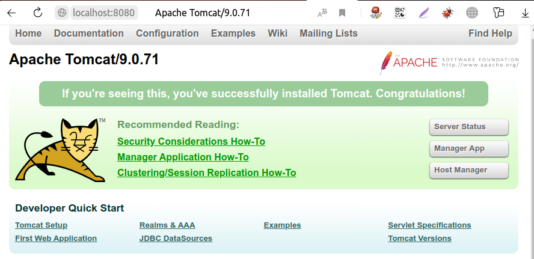
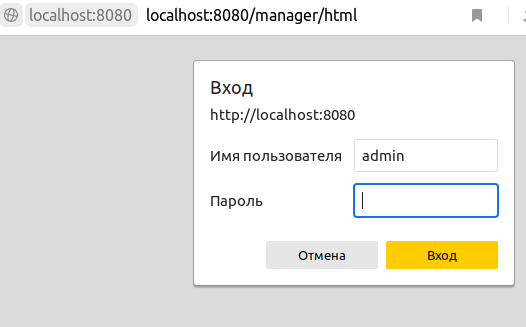
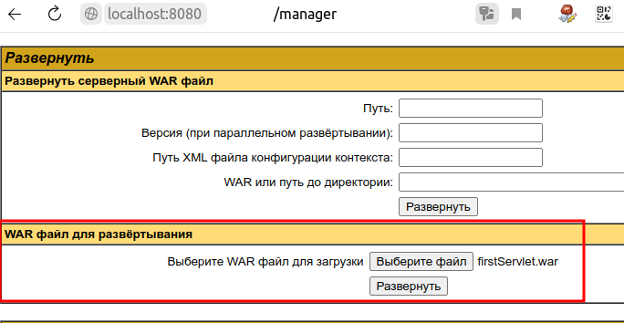
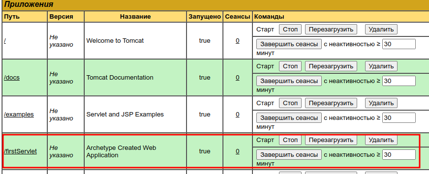
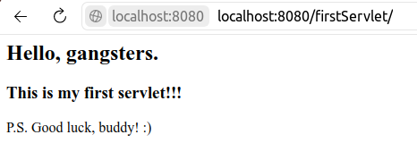
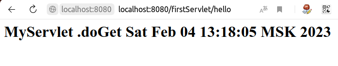

## Apache Tomcat. Сервлеты
<image src="https://www.hostiki.com/blog/wp-content/uploads/2022/01/Apache-Tomcat-414x232.png"/>

Данный репозиторий содержит _**сервлет**_,
который запускается при помощи _**Apache Tomcat**_.

При тестировании приложения использовался _**Tomcat 9 (9.0.71)**_.

## Содержание
1. [Что такое Tomcat?](#about-tomcat)
2. [Деплой приложения](#deploy)
3. [Работа сервлета](#working-servlet)

### Что такое Tomcat? <a name="about-tomcat"></a>
Apache Tomcat - ПО с открытым исходным кодом, реализующее набор технологий, которые 
входят в Java Enterprise Edition (EE): Java Servlet, Java Servlet Pages,
Java Expression Language, Java WebSocket.

### Деплой веб-приложения <a name="deploy"></a>
Развертывание приложения осуществляется либо через веб-интерфейс,
либо c помощью копирования WAR-файла внутрь папки `webapps` установки Tomcat.
Изучим, как развернуть приложение с помощью веб-интерфейса.

1. Распаковать дистрибутив Tomcat и поместить в удобное место.
2. Отредактировать файл **conf/tomcat-users.xml**, добавив внутрь 
секции **tomcat-users** следующие строки:
```html
<role rolename="manager-gui"/>
<role rolename="admin-gui"/>
<user username="your_name" password="your_password" roles="admin-gui, manager-gui"/>
```
3. Собрать WAR-файл приложения, с помощью Maven 
Lifecycle: `clean`, а затем нажать `package`.

Структура Lifecycle:
```
   ├── Lifecycle
   │   ├── clean
   │   ├── validate
   │   ├── compile
   │   ├── test
   │   ├── package
   │   ├── verify
   │   ├── install
   │   ├── site
   │   ├── deploy
   ├── Plugins
   ├── Dependencies
```
4. Запустить Tomcat, выполнив скрипт `startup.bat` (для
Windows) или `startup.sh` (для Linux).

Пример выполнения скрипта.
```
$ ./startup.sh
Using CATALINA_BASE: ...
USing CATALINA_HOME: ...
Using CATALINA_TMPDIR: ...
Using JRE_HOME: ...
Using CLASSPATH: ...
Using CATALINA_OPTS: ...
Tomcat started.
```
5. Запустить браузер, ввести в адресную строку:
`http://localhost:8080/`. 

Должно появиться окно, которое представлено ниже:



6. Выбрать `Manager App`, указать имя пользователя и пароль, которые
были добавлены в файл _**tomcat-users.xml**_ (см. пункт 2).

Вход в Manager представлен ниже:



7. Выбрать WAR-файл для развертывания, а затем
нажать кнопку _**"Развернуть"**_.



8. Должно появиться название веб-приложения, его путь:



9. Нажимаем на `/firstServlet`, должно появиться диалоговое окно:



Ура! Мы развернули веб-приложение, отобразили
содержимое JSP-страницы.

### Запуск приложения в IntelliJ Idea
Расскажу, как собрать проект, используя IntelliJ Idea.
1. Установить плагин Smart Tomcat (`Ctrl` + `Alt` + `S` 
-> `Plugins` -> `Marketplace` -> `Smart Tomcat` -> `Install`).


2. Выбрать `Edit Configurations...`, а затем нажать `+`.
3. В появившемся окне выбрать `Smart Tomcat`.
4. Заполнить окно `Run/Debug Configurations`, а затем нажать
`Apply` и `OK`.


5. Отлично! Веб-приложение можно запускать, используя кнопку `Run`.


### Работа сервлета <a name="working-servlet"></a>

